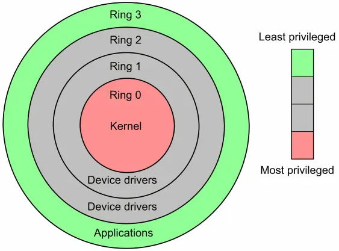


This article may be factually incorrect, feel free to correct me by opening a pull request or submitting an issue on my github repo. 


## Introduction
More often than not, I get asked the question - "Why do you use Linux, what is it and why don't you use Windows/MacOS as your primary operating system?". In this blog post, I shall explain to you in detail about what Linux is and why I use it 

## What is Linux?

Just like Windows, MacOS, iOS, Android, etc. Linux is just another operating system. Fun fact, the Android operating system is based on Linux.

To be more specific, Linux is a kernel and not the operating system itself. A kernel is the core of the operating system that controls the CPU, memory and other devices. What we refer to as the Linux operating system is actually GNU/Linux and not just Linux. Linux is not an operating system by itself but is another free component of a fully functioning GNU system made possible by GNU corelibs, shell utilities and vital system components comprising a full OS as defined by POSIX.

If all of this went over your head, in simple terms the Linux operating system is actually known as GNU/Linux which uses Linux as its base (Kernel) along with GNU utilities. Most of the webservers around the world use Linux. 

## Why not windows?

First and foremost, Windows is closed-sourced. No one but Microsoft knows what really lies underneath the depths of the Windows source code. In more recent years, Microsoft has really started to push their boundaries with collecting user data, spying, telemetry, advertisements, limited customizabilty, etc. All of these factors make it such that the user is being operated by the operating system and not the other way around. 

With this constant cycle of trash Windows releases, increased telemetry, advertisements , etc. It was only a matter of time before I had to find an alternative to switch to.

## Why I use Linux
Linux is open-source, I have full control over everything that happens in my system. I was sold by the idea of Open-Source, no telemetry, full control. When using Linux, I feel like Im using the system how it's supposed to be used - with the user in control of the operating system. I can honestly go on and on about why I use Linux but these are the main reasons.

There are hundreds upon hundreds of GNU/Linux operating systems and they are known as distributions or 'distro' for short.I've probably tried out around 20-30 of them (back when I had free time during COVID-19 lockdown). The distro that I currently use is [Arch Linux](https://archlinux.org/). It is a minimalist distro and is probably not advisable for beginners as it can be confusing and tedious for Linux noobs. 

## Should you use Linux?
It depends. Do you like the idea of having freedom from evil companies like Microsoft, Apple, Google...? Are you prepared to learn a lot of new things, having hardships figuring out how to use something entierly different? If you answered yes to these questions, then boot up any Linux distro on a virtual machine, spare computer or try it out on a live USB!

The software compatibality on Linux can be tricky, software like Adobe products like Photoshop, Premier Pro,etc do not work on Linux. They have their alternatives like [GIMP](https://www.gimp.org/) and [Kdenlive](https://kdenlive.org/) but can't really compete with their mainstream competition on a professional level. Gaming is also another huge problem on Linux as most games with Anti-Cheat (eg: Valorant, Fortnite) don't work underneath linux. So if these sound like a problem to you then Linux is probably not for you yet.

If you're trying out Linux and don't know where to begin. I recommend these distros:
- [Fedora](https://getfedora.org/)
- [Linux Mint](https://linuxmint.com/)
- [PopOS](https://pop.system76.com/)
